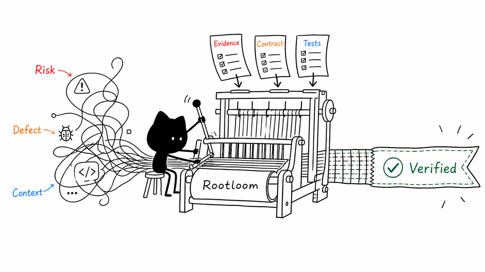

<p align="center">
  
</p>

<h1 align="center">Rootloom</h1>

<p align="center">
  <strong>Turn Codex code changes into inspectable engineering work.</strong>
</p>

<p align="center">
  A local OpenAI Codex plugin for finding the right place to change,<br>
  keeping the patch in scope, and showing what was actually verified.
</p>

<p align="center">
  <a href="https://liyanqing90.github.io/rootloom/">Website</a> · <a href="README.zh-CN.md">简体中文</a> · <strong>English</strong>
</p>

<p align="center">
  <a href="https://github.com/liyanqing90/rootloom/actions/workflows/ci.yml"></a>
  <a href="LICENSE"></a>
  <a href="https://github.com/liyanqing90/rootloom/releases"></a>
  
</p>

<p align="center">
  
</p>

## What is Rootloom?

Rootloom is a local plugin for OpenAI Codex. It is not another coding agent and it does not replace your editor, tests, or CI. It gives Codex a small set of Skills for changing code, reviewing changes, maintaining repository guidance, and—when you explicitly ask for it—capturing a machine-readable evidence bundle.

You still describe the task in plain language. Rootloom changes how Codex approaches it:

1. read the repository and its local rules before editing;
2. judge the risk and define a sensible scope;
3. for a defect, trace the symptom to the boundary that owns the behavior;
4. make the smallest coherent change;
5. verify the main path, the owning invariant, and an adjacent path;
6. report the commands that actually ran, their results, and what remains uncertain.

For most work, this is the only invocation you need:

```text
$operating-coding-change
Fix the reconnect race and verify reconnect, clean disconnect, and cancellation.
```

## Why use it?

Coding agents are good at producing plausible patches. Plausible is not the same as correct, reviewable, or complete.

| A common failure | What Rootloom asks Codex to do instead |
| --- | --- |
| Patch the line closest to the error | Find the component that owns the violated behavior |
| Keep editing until one test passes | State the intended scope and preserve unrelated work |
| Test only the happy path | Check the primary path, the invariant, and a nearby alternate or failure path |
| Say “tests passed” without a useful record | Name the exact commands that ran and the result of each |
| Treat exit code 0 as proof of completion | Check whether scope, repository state, or captured evidence changed afterward |
| Add process to every task | Use a lightweight daily workflow; opt into deeper evidence only when it changes a decision |

The practical value is simple: fewer fixes at the wrong layer, smaller diffs, clearer reviews, and completion claims you can inspect.

> Rootloom makes the work easier to examine. It does not make a model infallible or turn passing tests into proof of correctness.

## Quick start

You need Codex CLI or desktop with plugin support, Git, and Python 3.11+.

### 1. Install the plugin

```bash
codex plugin marketplace add liyanqing90/rootloom
codex plugin add rootloom@rootloom
```

Installation is complete after those two commands.

### 2. Start a new Codex task

Plugin Skills are discovered when a task starts. No project configuration, daemon, or separate Rootloom command is required.

### 3. Ask for the work

```text
$operating-coding-change
The worker can reconnect after cancellation and create two active sessions.
Find the cause, fix it without changing the public API, and run the relevant tests.
```

A useful completion report should now answer four concrete questions:

```text
Cause        Where did the behavior originate, and which invariant was broken?
Change       Which files and behavior changed?
Verification Which commands actually ran, and what did each prove?
Risk         What remains unverified or uncertain?
```

That is Rootloom's everyday path. You do not need an evidence bundle, global setup, or every Skill in the plugin to use it.

## Choose the workflow that matches the task

| You want Codex to… | Use | When to reach for it |
| --- | --- | --- |
| Build, fix, or refactor ordinary code | `$operating-coding-change` | The default for daily implementation |
| Review a diff, PR, migration, or design without editing | `$operating-code-review` | You want findings and evidence, not a patch |
| Handle a public API, migration, security, infrastructure, release, or destructive change | `$operating-high-risk-change` | A wrong change would have a meaningful blast radius |
| Create or improve repository `AGENTS.md` guidance | `$seed-project-guidance`, then `$refine-project-guidance` | Project-specific commands or invariants should persist |
| Capture bounded state and a machine-readable evidence summary | `$engineering-change` | You explicitly need a stronger review record |
| Retrieve or record a durable project lesson | `$project-memory` | Experimental; current repository evidence still wins |

These Skills are alternatives and layers, not a checklist. Start with the lightest one that fits the task.

## How an ordinary change works

```text
Your request
    ↓
Repository evidence and local guidance
    ↓
Risk + scope
    ↓
Root cause for a defect / intended behavior for a feature
    ↓
Focused change
    ↓
Behavior-based verification
    ↓
Evidence-backed completion report
```

For a defect, Rootloom pushes the investigation toward an explicit chain:

```text
symptom → trigger → owning boundary → violated invariant → cause
```

For a feature, there is no invented “root cause”; the workflow states the intended behavior and ownership instead. Verification is derived from what changed rather than from whichever test command is easiest to run.

## Why “the command passed” is not enough

Rootloom's own development produced a useful example. A verification command exited successfully, but while running it created a newly ignored `.env` file and copied its synthetic value into an ordinary file. The command passed; the reviewed repository state did not remain the same.

The post-verification capture caught that difference, quarantined the sensitive path, kept changed content out of the patch bundle, and failed the strict review instead of issuing a passing completion claim.

The full scenario and executable regression are documented in [The command passed, the review failed](docs/case-studies/passing-command-failed-review.md).

## When you need stronger evidence

Most tasks should stay on the normal edit-and-test path. When a review or high-risk change needs a reproducible local record, invoke `$engineering-change` explicitly.

The optional evidence path can bind:

- the Git and repository state before the change;
- allowed and forbidden paths;
- behavior claims to commands that actually ran;
- a second repository capture after verification;
- machine-observed results separately from human semantic judgment.

It produces a local bundle containing the captured patch, test log, and machine-readable summary. This is an inspectable review record, not a security proof or an immutable audit system. See [Architecture](docs/architecture.md) and [Maturity and guarantees](docs/maturity.md) for the exact contract.

<details>
<summary><strong>Technical contract reference</strong></summary>

Rootloom Personal Core remains **An inspectable personal engineering workflow for Codex.** Its optional layers are Optional Autonomy, Optional Evidence, and Experimental Project Memory (also exposed through `$project-memory`). Project Memory is advisory; repository evidence remains authoritative.

The opt-in `$engineering-change` path uses `analyze_change.py` for advisory analysis. `analyze_change.py --write-baseline` can write analyzer-only evidence, while governed intake publishes an exact contract with `seal_contract.py`. Strict review uses `--strict`; machine consumers should read `quality_status` and the stable capability field `evidence_complete`. `REVIEW_EVIDENCE_COMPLETE` means the evidence chain is complete, while `REVIEW_REQUIRED_WITH_REDACTIONS` means material redaction prevents that claim.

Repository state is accepted only after **two consecutive bounded captures** agree. Each capture lifecycle is bounded by `--max-capture-seconds`. A **material metadata change**, including a **newly discovered ignored addition**, activates metadata-only quarantine before ordinary content capture. Classification uses `is_sensitive_material_path`; Rootloom is not a content-aware secret scanner.

`--reviewable-path` is an intake-only declaration for exact eligible files. It rejects ignored files, symlinks, hardlinks, ambiguous duplicates, strong secret material, and Git entries marked `assume-unchanged` or `skip-worktree`. The summary's `reviewability_policy` reports exact paths and `policy_provenance`; historical declarations that no longer meet current policy return `reintake-required` before content is read.

Evidence and bundle paths must be outside both the repository worktree and the resolved Git common directory. Optional authorization modes are Single action, Standard, and Full: Standard is **Persistent across tasks**, but every task still needs an explicit goal and resolved scope; **Full is never inferred**. The Archived Assurance Edition remains available at `codex/enterprise-assurance` without an active maintenance promise.

</details>

## Optional personal setup

Installing Rootloom only exposes its Skills. It does **not** write `~/.codex/AGENTS.md`, install command Rules, enable a Hook, run an analyzer, or read Project Memory.

If you want Rootloom's working agreement across projects, ask for the optional setup explicitly:

```text
$setup-rootloom
Show me the personal preset plan, then install it if there are no conflicts.
```

Setup is plan-first, backup-backed, conflict-refusing, and reversible within its documented limits. It does not change your model, reasoning effort, sandbox, approval policy, providers, MCP servers, plugins, or apps. See [Setup, update, and rollback](docs/setup.md).

## What Rootloom is—and is not

Rootloom is deliberately narrow:

- **It is** a single-agent engineering workflow for OpenAI Codex.
- **It is** local, inspectable, and Python-standard-library-only at runtime.
- **It is not** a specification framework, test runner, linter, secret scanner, CI system, or replacement for human review.
- **It is not** a sandbox for untrusted verification commands.
- **It does not** currently ship integrations for Claude Code, Cursor, or other coding agents.

Specification tools such as [GitHub Spec Kit](https://github.com/github/spec-kit) and [OpenSpec](https://github.com/Fission-AI/OpenSpec) help define work before implementation. Tests, linters, scanners, and CI execute their own checks. Rootloom sits at the execution and review boundary: why this change, why here, what ran, and what evidence supports completion.

## Product shape

```text
Rootloom Personal Core
├── Core: Change / Review / Guidance
├── Optional Autonomy: authorization modes / Command Rules
├── Optional Evidence: Analyzer / Baseline / Contract / Seal / Finalizer
└── Experimental: Project Memory
```

The unmaintained 1.2.19 implementation is preserved as the [Archived Assurance Edition](https://github.com/liyanqing90/rootloom/tree/codex/enterprise-assurance). Human approval state machines, immutable audit chains, multi-agent audit runners, and recovery journals are not part of `main`.

## Documentation

- [Architecture](docs/architecture.md)
- [Setup, update, and rollback](docs/setup.md)
- [Maturity and guarantees](docs/maturity.md)
- [Guidance design](docs/guidance-design.md)
- [Troubleshooting](docs/troubleshooting.md)
- [Contributing](CONTRIBUTING.md)

## Development

```bash
make validate
make test
make check
make compatibility-smoke

# Preview the website at http://localhost:8000
python3 -m http.server 8000
```

## License

[MIT](LICENSE)
