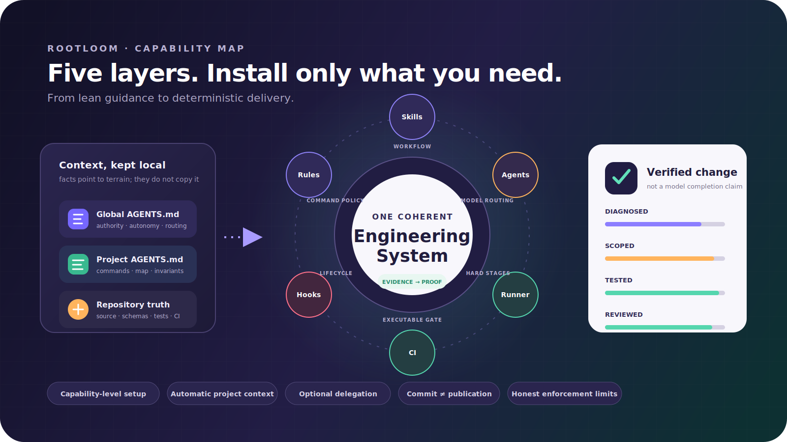

<p align="center">
  
</p>

<h1 align="center">Rootloom</h1>

<p align="center">
  <strong>从根部织起可靠的 Codex 工程。</strong>
</p>

<p align="center">
  <strong>简体中文</strong> · <a href="README.md">English</a>
</p>

<p align="center">
  <a href="https://github.com/liyanqing90/rootloom/actions/workflows/ci.yml"></a>
  <a href="LICENSE"></a>
  <a href="https://github.com/liyanqing90/rootloom/releases"></a>
  
</p>


Rootloom 让用户只安装真正需要的 Codex 能力，不会被迫同时接受子代理、Hooks 或一份巨型提示词：

| 能力 | 实际交付物 |
| --- | --- |
| 全局策略 | 打磨完成、可直接安装的全局 [`AGENTS.md`](plugins/rootloom/assets/system/AGENTS.md) |
| 项目上下文 | 自动生成有证据的根指导，并按需生成嵌套指导 |
| 指导质量 | `$refine-project-guidance` 只补充持久语义不变量，不制造文件级文档噪音 |
| 工程工作流 | 普通修改、只读审查、高风险和显式高保障 Skills |
| 模型路由 | 四个明确模型、推理等级、角色和 sandbox 默认值的 Agent TOML |
| 运行与命令 | 质量优先 profile、四线程并发上限和经过测试的命令 Rules |
| 证据与记忆 | 可归因的运行时/外部证据，以及可选的仓库内工程决策记录 |
| 确定性流程 | 唯一写代理、范围门禁、真实验证和独立评审的 `codex exec` Runner |

仓库、marketplace 与插件统一使用稳定公开 ID：`rootloom`。

> **成熟度说明：** Rootloom 目前是早期、单维护者项目。“可靠”是设计目标，不代表已经证明能够降低缺陷率。确定性门禁约束的是部分流程机制，不保证模型证据或根因诊断为真。详见[成熟度、保证边界与兼容性](docs/maturity.zh-CN.md)。

## 为什么叫 Rootloom

**Root** 是仓库事实：源码、Schema、测试、项目指导与根因证据。**Loom** 是织架：把 Skills、Hooks、Rules、Agents 和验证编织成完整能力层。播种上下文只是第一根线，而不是整个产品。



## 为什么是系统，而不是更长的提示词

OpenAI 当前 [GPT-5.6 指南](https://developers.openai.com/api/docs/guides/latest-model)建议精简提示词、规则只写一次，并清楚定义自主权、审批边界、约束和成功标准。Codex 已经为不同问题提供了更合适的位置：

- [`AGENTS.md`](https://developers.openai.com/codex/agent-configuration/agents-md)：稳定的全局和局部指导；
- [Skills](https://developers.openai.com/codex/build-skills)：渐进加载的可复用流程；
- [自定义 Agents](https://developers.openai.com/codex/agent-configuration/subagents)：角色、模型、推理、sandbox、MCP 和 Apps；
- [Rules](https://developers.openai.com/codex/agent-configuration/rules)：命令策略；
- [Hooks](https://developers.openai.com/codex/hooks)：确定性生命周期动作和审计；
- profiles、脚本、测试和 CI：运行默认值与可执行证据。

把一切都塞进 `AGENTS.md` 只会浪费上下文，并把建议伪装成强制执行。本项目让每一层保持狭窄，并明确它真正能保证什么。

## 安装

要求：

- 支持插件和生命周期 Hook 的 Codex CLI 或 Codex 桌面端；
- Git；
- Python 3.11 或更高版本。

添加 GitHub marketplace 并安装稳定包 ID：

```bash
codex plugin marketplace add liyanqing90/rootloom
codex plugin add rootloom@rootloom
```

新建 Codex 任务，先选择能力层级，再决定是否信任可选 Hooks：

| 预设 | 启用能力 | 子代理 |
| --- | --- | --- |
| `skills-only` | 只有内置 Skills；不写用户策略/运行资产；关闭生命周期 Hooks | 无 |
| `guidance` | 全局策略 + 自动项目上下文 | 无 |
| `engineering` | 指导层 + 命令安全；普通开发推荐 | 无 |
| `delegated` | 工程层 + 四角色配置与建议式委派审计 | 已配置；已验证 spawn 表面无法证明原生角色/模型路由 |
| `full` | 委派层 + 严格连续 Runner profile | 已配置；需用 Runner 获得可证明路由 |

然后让 Codex 规划并应用所选层级，无需手动编辑：

```text
$setup-rootloom
先展示能力层级，再规划并应用 engineering 预设。
```

需要本仓库的整套系统时选择 `full`。高级用户可以组合稳定维度：`global-policy`、`project-context`、`command-safety`、`delegation-control` 和 `high-assurance`；依赖会自动补齐。

Setup 完成后打开 `/hooks` 审查两条命令；若所选层级启用了任一 Hook，再信任当前定义：

- `SessionStart`：仅在选择 `project-context` 时安全播种本地项目指导。
- `SubagentStart`：仅在选择 `delegation-control` 时审计累计子代理预算和命名角色/模型路由。

setup Skill 会先规划，并用进程锁串行化每个 Codex home 的事务。它在修改前准备备份与恢复清单，原子写入并记录哈希和权限模式；即使状态提交失败也会补偿整笔事务。没有明确授权时，它拒绝覆盖用户自有冲突文件。

完整契约见[安装、更新与回滚](docs/setup.zh-CN.md)。

## Setup 实际安装什么

| 能力 | 路径 | 用途 |
| --- | --- | --- |
| `global-policy` | `~/.codex/AGENTS.md` | 权限、自主权、工程、证据、路由、委派和沟通的精简全局协议 |
| `project-context` / Hooks | `~/.codex/.rootloom/components.json` | 分别启停项目播种与子代理审计 |
| `delegation-control` | `~/.codex/config.toml` | 只管理 `agents.max_threads = 4`、`max_depth = 1` 和中断可见性；其余键保留 |
| `high-assurance` | `~/.codex/high-assurance.config.toml` | Sol/high、on-request、workspace-write 的质量优先 CLI profile |
| `delegation-control` | `~/.codex/agents/*.toml` | Terra 证据调查 + Sol 根因、实施、验收的原子角色组 |
| `command-safety` | `~/.codex/rules/rootloom.rules` | 允许本地 commit，单独治理发布、基础设施和破坏性命令 |

Setup 不会改变你的普通默认模型、推理等级、审批策略、sandbox、供应商、MCP、插件或 Apps，也不会把 `delegation-control` 拆成容易误导人的半套角色。

## 两份 `AGENTS.md` 成果

仓库包含真实打磨成果，而不只是说明文字：

- [全局工作协议](plugins/rootloom/assets/system/AGENTS.md)：跨项目安装。
- [项目指导成品示例](examples/AGENTS.project.md)：托管事实 + 精简用户不变量。
- [本仓库自己的 AGENTS.md](AGENTS.md)：真实的生成与打磨示例。

### 全局指导只拥有稳定行为

它定义授权、可逆自主执行、任务分级、工作区保护、根因与范围默认值、证据标准、流程路由、自动项目指导、委派上限和精简沟通；不包含仓库命令、框架偏好、项目架构或人格扮演。

### 项目指导只拥有仓库事实

`SessionStart` Hook 确定性提取项目定位、事实来源文件、顶级结构、包管理器、标准命令、CI 和模块边界。它只写入带标记的托管区块，并保留区块外全部内容。

`$refine-project-guidance` 只添加会改变未来决策的持久、有路径证据的不变量：所有权方向、生成代码边界、公开或持久化契约，以及权威架构/迁移/验证文档。

只有具备独立 Manifest、命令、所有权或不变量的真实模块边界才会得到嵌套指导。系统绝不强制创建每文件 L3 注释。

## 分级任务入口与根因门禁

Rootloom 的全部工程工作流共用一套风险词汇：

| 等级 | 适用任务 | 入口与证据 |
| --- | --- | --- |
| Tier 0 Direct | 琐碎、低风险、可逆的机械工作 | 直接执行，只做最小相关检查 |
| Tier 1 Scoped | 普通 Bug、功能切片、重构和边界明确的多文件工作 | 内部补全 `Intent + Context + Tools + Constraints + Verification`，要求定向证据 |
| Tier 2 Governed | 跨边界、高风险、对外变更或根因存在实质不确定性的工作 | 展示治理任务包、影响图、兼容/回滚与显式门禁 |

行为缺陷默认至少是 Tier 1，除非修正可被证明为纯机械操作。Tier 1 沿“现象 → 触发条件 → 所有权路径 → 被破坏的不变量 → 根因”诊断；Tier 2 再加入竞争假设和 GO/NO_GO 门禁。可逆绕行必须标记为 `MITIGATION`，绝不能冒充完整根因修复。

Tier 0 和 Tier 1 的任务包默认只在内部使用；只有用户要求、需要交接、存在阻塞决策或进入 Tier 2 时才展示，避免把小修改官僚化。

## 完整工作流系列

| Skill | 触发场景 | 核心契约 |
| --- | --- | --- |
| `$setup-rootloom` | 显式安装、更新、审计、换层或回滚 | 选择能力预设；先计划；绝不静默替换用户策略 |
| `$seed-project-guidance` | 指导缺失或结构事实过期 | 只生成确定性事实 |
| `$refine-project-guidance` | 第一次非平凡任务、重复犯错或架构/契约变化 | 只补充持久项目不变量 |
| `$record-engineering-decision` | 已接受的架构、契约、依赖、安全、数据或运维选择需要跨任务保留 | 仓库内上下文、备选方案、证据来源、后果与重新评估条件 |
| `$operating-coding-change` | Tier 0 Direct 与 Tier 1 Scoped 实施 | Software 3.0 入口、分级根因门禁、小范围 diff、成比例验证 |
| `$operating-code-review` | 只读审查 | 证据化 findings 优先，不修改 |
| `$operating-high-risk-change` | Tier 2 Governed 的 API、Schema、数据、安全、基础设施、部署、发布或不确定根因 | 治理任务包、ExecPlan、诊断、兼容、回滚、授权门禁 |
| `$high-assurance-coding-change` | 用户显式要求受控多代理 | 证据 → 根因门禁 → 唯一写代理 → 确定性验证 → 独立评审 |

普通任务保持单 Agent。高保障流程是显式选择，因为多个 Agent 会增加 Token、延迟和协调风险。

## 模型路由

选择 `delegation-control` 后，默认角色分配优化的是交付总成本，而不是单次调用价格：

```text
evidence_explorer       gpt-5.6-terra / medium / read-only
root_cause_reviewer     gpt-5.6-sol   / xhigh  / read-only
implementation_worker   gpt-5.6-sol   / high   / workspace-write
verification_reviewer   gpt-5.6-sol   / xhigh  / read-only
```

Terra 只负责压缩受限证据；Sol 负责昂贵的判断、代码实施和最终验收。较弱模型永远不拥有最终根因、实现或接受决策。

自定义 Agent TOML 是预期的模型路由事实来源。但在当前验证过的原生 multi-agent v2 表面上，Rootloom 无法证明已启动子代理确实获得指定自定义 `agent_type`，所以 setup 校验会明确报告原生路由 `NOT_READY`。这些文件仍是有效配置输入，但当前只有连续 Runner 会显式应用并记录各阶段角色/模型。Skill 负责顺序和门禁，Hook 只做审计；父任务实时权限可能覆盖子代理默认值，因此需要硬隔离时应使用 Runner。

## 为什么限制四个却还能看到十个

`agents.max_threads = 4` 限制的是**同时打开的线程**，不是整个任务累计创建的子代理数量。四个 Agent 完成并关闭后，可以再创建六个，全程仍未超过四个并发。

可选的 `delegation-control` 层再增加两层控制：

- 全局指导和 Skills 规定每任务累计四个子代理的行为预算；
- `SubagentStart` 计数器向 UI 告警，并让第五个子代理停止工作、向父任务汇报。

当前 Hook API 无法在启动时取消子代理。超预算子代理已经启动，Hook 只能注入“停止并报告”指令，实际效果依赖该模型遵守。这是可见性与行为指导，不是预防性控制。确定性高保障 Runner 才是严格路径。

## `git commit` 不再掉进审批死锁

Rules 经过测试会得到：

```text
git commit          → allow
git push            → prompt
git reset --hard    → forbidden
```

本地 commit 是可逆仓库历史，不是远程发布。push、Release、包发布、基础设施变更和破坏性操作仍单独治理。

Rules 采用最严格的匹配结果。如果另一条宽泛规则写了 `git → prompt`，它会覆盖 `git commit → allow`。同时，`approval_policy = "never"` 无法回答 prompt，所以非交互执行中的 prompt 命令只会失败。Codex 命令 Rules 是仍在演进的 argv 前缀策略表面：`bash -c 'git ...'` 这类包装命令匹配的是 `bash`，不是内部 Git argv，可能落入更宽泛策略。Rootloom 不把 Rules 当作 shell 安全边界。安装文档给出了用 `codex execpolicy check` 检查决策的方法。

## 确定性高保障路径

当原生 spawn 表面无法证明指定角色/模型，或阶段顺序必须完全固定时，运行内置连续流水线：

```bash
python3 <high-assurance-skill-dir>/scripts/run_pipeline.py \
  --repo /absolute/path/to/repo \
  --task /absolute/path/to/task.md \
  --sensitive-path 'private/**' \
  --bind-verification-path verify-1:scripts/acceptance.sh \
  --max-command-output-bytes 8388608 \
  --max-verification-output-bytes 33554432 \
  --verify 'make focused-test' \
  --verify 'make check'
```

Runner 读取同一组四个 Agent TOML，并强制仓库锁、干净基线、只读阶段快照、唯一写代理、精确允许路径、Git index 不变、结构化输出、确定性验证、独立评审和最多一次修复循环。它会在 Writer 前为检测到的验证入口建立指纹，在每条验证命令执行前复查该命令的入口，并在命令结束后立即确认仓库未变化。绑定范围包括直接执行的仓库脚本、按命令关联的 `--bind-verification-path` 稳定性依赖、`make` 文件、JavaScript package manifest、pytest 配置文件、后续可能取得优先级的缺失常见候选，以及仓库内每个 symlink 路径组件与最终目标内容。操作方绑定和直接脚本必须解析为已存在的普通文件。存在多条用户验证命令时使用 `verify-N:path`；只有一条用户命令时才兼容裸路径写法。它支持 Linux、macOS 与 WSL，不支持原生 Windows。进程组清理和输出 drain 均有界，但创建新 session 的后代仍可逃离原组；不可信命令需要容器、cgroup 或等价作业隔离。产物为私有，并且必须位于目标仓库之外。

每条模型或验证命令默认拥有 8 MiB 合并输出预算。捕获只保留有界 tail；超限会终止原进程组，并结构化记录观察/保留字节数、截断、drain cutoff 和 detached 后代风险。模型阶段会把这些字段写入相邻的 `*-command.json` sidecar。只有在评估内存与产物成本后，才应通过 `--max-command-output-bytes` 设置其他正整数预算。

每批确定性验证还拥有 32 MiB 保留输出总预算和 64 条命令硬上限。`--max-verification-output-bytes` 可以调低或调高正整数批次预算；命令数量上限固定。提供给修复与 Review 阶段的紧凑验证摘要最多 120,000 字符，完整但有界的私有机器记录仍会保留。异常退出会在直接父进程已经结束时继续清理原进程组。这些是本地 Runner 边界，不是对创建新 session 后代的宿主级隔离。

验证命令默认只接收最小可移植环境（存在时的 `PATH`、`HOME`、locale、临时目录、终端、用户与 `CI` 变量），并固定 `PYTHONDONTWRITEBYTECODE=1`。额外既有变量必须通过可重复的 `--verify-env NAME` 显式授权；产物只记录变量名，不记录值。这能减少意外继承凭据，但不是输出脱敏或文件访问隔离；不要传递生产 secret，不可信命令应在隔离环境运行。

已知疑似密钥名称会在任何内容指纹前被归为元数据。仓库专有名称可重复传入 `--sensitive-path path` 或 `--sensitive-path 'directory/**'`；如果所有未跟踪 dotfile 都应元数据化，可启用 `--redact-untracked-dotfiles`。这些控制只脱敏自动产物和随 Prompt 提供的数据，不能阻止具有仓库读取能力的 Evidence、Diagnosis、Implementation 或 Review 阶段主动打开文件。需要访问隔离时，应使用不含 secret 的 worktree 或 OS/container 挂载边界。

这是路径级脱敏，不是内容血缘追踪或 DLP。若模型或命令把 protected 字节复制到普通允许路径，新路径仍可能被内容哈希并进入 Delta。要阻止这类泄漏，必须使用 deny-read 挂载、无 secret worktree 或外部 DLP 边界。

metadata-only 路径同时受到验收保护：任何在基线被保护的路径都会在整个 Run 中保持 metadata-only，即使后续 ignore 配置发生变化；对既有 protected 路径的去分类会在 Delta 捕获前被拒绝。Writer 返回后，即使 Diagnosis 的 `allowed_paths` 包含它们，Runner 也会拒绝任何检测到的 ignored 或敏感 visible-untracked 创建、修改或删除。这是写后机器门禁，不是 OS 级写入预防或回滚；失败任务可能留下 protected 文件系统变化，需要操作方恢复。确需删除时，必须为每个文件显式传入 `--allow-protected-path-delete path`；目录与 glob 会被拒绝，路径会在 Writer 启动前完成预检，`--allow-dirty` 和 repair cycle 会被拒绝，旧内容不会被读取或备份，并且该任务会变成 deletion-only：普通代码修改、rename、move 或 visible 文件创建都必须拆到另一次任务。模型评审成功后仍以 `HUMAN_REVIEW_REQUIRED` 退出码 10 停止，而不会自动 PASS。Topology 会在启动、每次 Writer 后、确定性验证后和最终 Review 后复查。

完整边界见[架构](docs/architecture.zh-CN.md)。

## GEB：保留洞察，去掉提示词债务

[GEB 系统](https://chunxiang.space/geb-system)正确强调了分层局部上下文和代码/文档回环。本项目保留这些思想，转换为全局 → 根目录 → 真实模块的指导层级与自动播种。

本项目舍弃身份扮演、隐藏思考指令、通用文件行数法则、完整 L2 文件清单、强制 L3 源码头部，以及会阻塞无关工作的文档扩张。这些做法与精简提示词冲突，也会制造陈旧重复的“地形副本”。

详细分析见[官方指南与 GEB 对照](docs/guidance-design.zh-CN.md)。

## 为什么核心不带 MCP

核心只需要本地 Git/文件证据和 Codex 原生配置。增加 MCP 会多出进程和信任面，却没有新增缺失能力。

只有当某个自定义角色确实需要外部事实来源——内部文档、Issue、可观测性或部署——才应为这个窄角色配置 MCP 和工具审批。对关键证据记录环境、观察时间或时间窗、稳定产物/查询/Trace 引用、新鲜度/脱敏与事实/推断状态，而不是为了架构清单完整让所有编码任务继承一个集成。

严格 Runner 保持离线。应在运行前收集已授权的运行时证据，只传入受限且脱敏的材料。事实与复现必须引用稳定来源 ID；这只能证明引用完整，不能证明所引路径、测试、行号或陈述真实。仓库快照只对已跟踪文件和普通可见未跟踪交付物做内容哈希；ignored 路径以及已知或显式配置的敏感可见未跟踪路径会先完成分类，只记录不含内容哈希的元数据，绝不进入 Runner patch 或 Reviewer 提示。验证入口复用同一分类：protected harness 或解析后的目标会在任何内容读取或哈希前被拒绝。内置名称匹配是有限清单，不可能发现所有 secret。ignored 枚举超过可配置预算时会关闭式失败。每项诊断验证要求还必须映射到成功的机器命令 ID，并且至少包含一条用户提供的验证命令，不能只依赖 `git diff --check`；这证明执行关联和稳定性依赖，不证明所选命令在语义上充分、真实使用该依赖，或隐藏参数路径都被解析。`pytest tests/unit` 与 `pytest tests/test_new.py` 这类位置参数会被视为测试选择范围，而不是可执行入口。

## 安全模型

- 项目播种是本地、受限、确定性、仅标准库、零网络的；它排除符号链接和仓库外证据，通过 Git 公共目录串行化写入，并在生成期间指导发生变化时安全跳过。
- 无标记指导、override、符号链接、不可信仓库、退出项目、临时/vendor/cache 目录、疑似密钥和损坏托管区块都会被保留或拒绝。
- 全局 setup 是显式、进程加锁、预写恢复清单、哈希校验、权限模式保留且可回滚的，并会补偿可捕获的 apply/rollback 失败；它尚不能保证 `SIGKILL`、主机崩溃或断电下的崩溃一致性。
- 只读角色默认关闭 Apps；标准角色中只有一个可写。
- Rules、sandbox、Hooks、Skills 和模型指令是纵深防御，不能替代 OS 策略、凭据、分支保护、审查或 CI。

## 兼容策略

普通 CI 在 Linux 上验证固定的 Codex CLI 基线；另一条 Linux 定时工作流探测最新 CLI，在维护者审查并正式采用上游变化前只提供信息。两条轨道运行的是离线“集成形状”冒烟，覆盖 marketplace 安装、插件发现、setup/status/验证、profile、Rules、回滚和既有配置保留；它们不执行真实模型、不证明模型别名、不演练交互式 Hook，也不认证 Windows/macOS 行为。详见[成熟度、保证边界与兼容性](docs/maturity.zh-CN.md)。

## 更新

```bash
codex plugin marketplace upgrade rootloom
codex plugin add rootloom@rootloom
```

重新审查更新后的 Hook 定义，新建任务，再次调用 `$setup-rootloom`。计划只会展示变化的托管资产。

## 本地开发

```bash
git clone https://github.com/liyanqing90/rootloom.git
cd rootloom
make check
make compatibility-smoke
```

`make check` 会验证 marketplace、插件、Hooks、全部 Skills 及 UI 元数据、setup 资产、Python/SVG 语法、链接、发布卫生、疑似密钥、命令 Rules、播种器、setup/rollback、子代理预算和确定性 Runner 门禁。`make compatibility-smoke` 会在无需凭据或联网模型调用的前提下，用当前 Codex CLI 演练已安装插件的完整生命周期。

真实冒烟测试使用一次性 `CODEX_HOME`：

```bash
make smoke
```

## 文档

- [品牌系统与资产使用](docs/brand.zh-CN.md)
- [架构与执行边界](docs/architecture.zh-CN.md)
- [指导设计与 GEB 分析](docs/guidance-design.zh-CN.md)
- [安装、更新、回滚、commit 策略和子代理限制](docs/setup.zh-CN.md)
- [故障排查](docs/troubleshooting.zh-CN.md)
- [贡献指南](CONTRIBUTING.zh-CN.md)
- [安全策略](SECURITY.md)
- [更新日志](CHANGELOG.md)

## 许可证

[MIT](LICENSE) © 2026 liyanqing。
