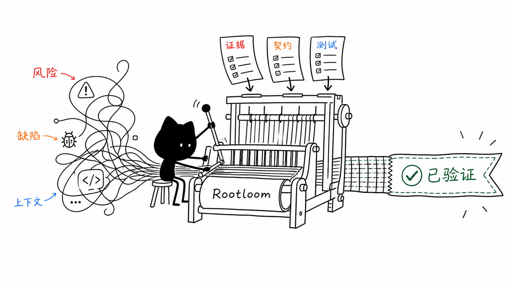
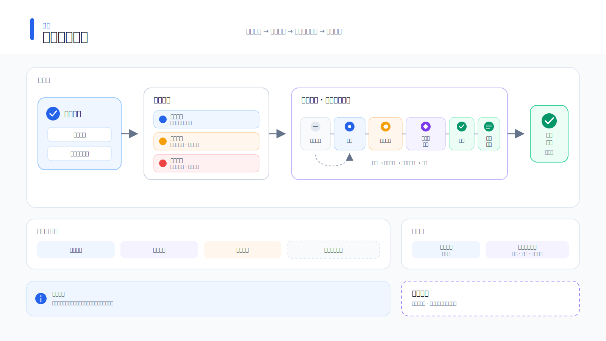

<p align="center">
  
</p>

<h1 align="center">Rootloom</h1>

<p align="center">
  <strong>让 Codex 按工程标准写代码的个人质量控制层。</strong>
</p>

<p align="center">
  <strong>简体中文</strong> · <a href="README.md">English</a>
</p>

<p align="center">
  <a href="https://github.com/liyanqing90/rootloom/actions/workflows/ci.yml"></a>
  <a href="LICENSE"></a>
  <a href="https://github.com/liyanqing90/rootloom/releases"></a>
  
</p>

<p align="center">
  
</p>

Rootloom Personal Core 只保留个人开发者每天都会使用的部分：

1. 判断任务到底有多大风险；
2. 追到真正拥有问题的不变量，而不是接受表面补丁；
3. 修改前先约束范围；
4. 根据行为变化选择验证；
5. 在相关任务中复用项目知识与失败经验。

默认采用单代理。Human Review 状态机、protected deletion 承诺、不可篡改 Artifact 链、共享环境加固锁、多代理审计 Runner 与 setup 恢复日志不再属于 `main`。

## 产品分支

| 产品 | 分支 | 定位 |
| --- | --- | --- |
| Rootloom Personal Core | `main` | 低摩擦日常工程 + 显式按需深度审查 |
| Rootloom Enterprise Assurance | [`codex/enterprise-assurance`](https://github.com/liyanqing90/rootloom/tree/codex/enterprise-assurance) | 保留 Human Review、protected deletion、严格 Runner 与恢复机制的审计工作流 |

这不是功能降级，而是明确的产品拆分。企业 Assurance 作为独立产品线保留，个人用户不再承担它的复杂度。

<p align="center">
  
</p>

> Rootloom 仍处于早期阶段，由单维护者维护。它能让流程机制可检查，但不能证明模型的证据或根因判断一定正确。参见[成熟度与保证](docs/maturity.zh-CN.md)。

## 显式按需的深度工程闭环

```text
任务
  ↓
风险扫描 ── 可解释的最低 Tier 0 / Tier 1 / Tier 2
  ↓
证据 → 根因 → Change Contract → 实现
  ↓
验证智能 → Final Review Summary
  ↖                         ↗
相关 Engineering Memory
```

Rootloom 不会因为插件已经安装就自动运行这套深度闭环。普通任务直接使用仓库现有的编辑与测试路径；只有这些证据确实有用时，才显式调用 analyzer、baseline、contract、memory 与 finalizer。

最终摘要保持轻量：

```json
{
  "changed_files": ["src/example.py"],
  "risk": "medium",
  "risk_assessment": {"minimum_tier": 1, "signals": [{"id": "behavioral-code"}]},
  "tests": [{"command": ["python3", "-m", "unittest"], "passed": true}],
  "verification_plan": {"status": "suggested-not-executed"},
  "commands_passed": true,
  "capture_preserved": true,
  "claim_binding": "complete",
  "verification_coverage": "complete",
  "semantic_coverage": "reviewed",
  "evidence_provenance": {
    "baseline": "operator-sealed",
    "change_contract": "operator-sealed",
    "verification_claims": "operator-sealed",
    "semantic_review": "operator-asserted"
  },
  "quality_status": "VERIFIED_CHANGE",
  "remaining_risks": []
}
```

## 包含能力

| 能力 | 结果 |
| --- | --- |
| Task Intelligence | 综合任务、路径、diff 与记忆信号，给出可解释最低 Tier 与工作流选择 |
| Engineering Workflow | 证据、根因、变更合同、实现、验证与审查 |
| Verification Intelligence | 风险专属行为清单与仓库命令建议；和已经执行的证据明确分开 |
| Project Guidance | 确定性根 `AGENTS.md` 播种与语义精炼 |
| Engineering Memory | 相关性检索、过期感知的 `.project-memory/` 架构、风险、决策与失败经验 |
| Decision Memory | 接受后的持久工程决策记录 |
| Command Safety | 区分可逆本地操作、破坏性操作与外部操作的 Rules |
| 轻量产物 | 普通 `diff.patch`、`test.log` 与 `summary.json` |

所有运行时辅助工具仅使用 Python 标准库，不依赖网络服务或数据库。

## 安装

需要支持插件的 Codex CLI 或桌面端、Git 与 Python 3.11+。

```bash
codex plugin marketplace add liyanqing90/rootloom
codex plugin add rootloom@rootloom
```

两条命令完成后插件即安装完毕。新建 Codex 任务以加载 Skills。插件安装不会写入 `~/.codex/AGENTS.md`、安装命令 Rules、启用 Hook，也不会运行 analyzer、baseline、contract、finalizer 或 project-memory 读取。

只有明确需要跨项目全局策略时，才可选调用 `$setup-rootloom`：

```text
$setup-rootloom
规划并安装可选的 personal preset。
```

setup preset：

| Preset | 启用内容 |
| --- | --- |
| `skills-only` | 仅插件 Skills；禁用项目指导 Hook |
| `guidance` | 全局工作协议 + 自动项目指导 |
| `personal` | Guidance + 命令安全；推荐且默认 |
| `engineering` | `personal` 的迁移兼容别名 |

`skills-only` 是合法的空 capability 选择。`status` 与后续未指定参数的 setup 操作会保持该选择，不会静默扩展为 `personal`。

`command-safety` 依赖并会自动包含 `global-policy`；授权感知命令规则不会脱离其语义策略单独安装。

可选 personal preset 只管理 `~/.codex/AGENTS.md`、`~/.codex/rules/rootloom.rules` 和 Rootloom 的小型组件/状态文件。它不会修改默认模型、推理强度、沙箱、审批策略、MCP、Provider、插件或 App；其策略仍让深度审查保持显式按需，不会变成默认门禁。

Rootloom 提供三档授权：

| 模式 | 有效期 | 覆盖范围 |
| --- | --- | --- |
| 本条命令 | 一次 | 仅当前展示的命令或动作 |
| 普通权限 | 跨任务持久 | 每个明确目标所需的全部非高危步骤；每个任务仍单独解析操作类型、仓库、账号、服务和环境 |
| 所有权限 | 当前任务 | 该任务已经声明的操作类型与范围内，包含高危操作在内的全部步骤 |

安装后的默认模式是普通权限，因此“发布这个插件”“部署这个服务”等请求在常规实现、发布、上线和核验步骤中不会逐条确认。所有权限绝不会被自动推断。静态命令规则会放行命令，避免重复一次语义授权判断；只有针对根目录、主目录、当前目录或父目录的灾难性递归删除仍是内置硬拒绝。命令规则本身不会产生授权，普通权限也不允许代理自行发起任务；平台、沙箱、组织、凭据以及其他有效规则仍然具有最高约束力。

信任前请检查唯一的 `SessionStart` Hook。只有安装策略明确启用时，它才执行确定性的项目指导播种；策略缺失、损坏或为符号链接时会关闭执行。

详见 [setup、更新与回滚](docs/setup.zh-CN.md)。

普通升级只需刷新 marketplace、重新安装插件并新建任务，不需要其他步骤。只有之前安装过可选全局 preset 且希望刷新其复制资产时，才显式运行一次 `$setup-rootloom` `upgrade`；它会保持已安装 preset，并拒绝覆盖安装后的漂移。

## 使用

明确需要深度审查包，或执行高风险/发布工作时：

```text
$engineering-change
修复重连竞态，并验证重连和正常断开路径。
```

Skill 会先运行本地建议式扫描。也可以在修改前直接检查相同 JSON：

```bash
python3 <engineering-change-skill>/scripts/analyze_change.py \
  --repo /absolute/path/to/repo \
  --task '修复重连竞态' \
  --path src/relay.py
```

结果会解释风险信号、最低 Tier、匹配的活跃记忆、过期历史以及应该验证的行为。它只是建议；语义证据仍可继续提高 Tier。

记录可复用项目知识：

```text
$project-memory
初始化项目记忆，然后记录已经证实的重连失败经验。
```

项目指导：

```text
$seed-project-guidance
$refine-project-guidance
```

风险工作流 Skills：

| Skill | 用途 |
| --- | --- |
| `$operating-coding-change` | Tier 0/1 实施纪律 |
| `$operating-code-review` | 仅做基于证据的审查 |
| `$operating-high-risk-change` | Tier 2 影响、兼容、发布、回滚与授权门禁 |
| `$record-engineering-decision` | 接受后的持久架构或契约记忆 |

子代理不再是默认要求。只有用户明确要求时才由平台和仓库策略决定是否委派；Personal Core 不安装自定义角色或审计 Hook。

## 验证产物

`$engineering-change` 可以在实现后以 advisory 模式调用：

```bash
python3 <engineering-change-skill>/scripts/finalize_change.py \
  --repo /absolute/path/to/repo \
  --output /absolute/path/to/run \
  --task '修复重连竞态' \
  --verify 'make test'
```

Advisory 模式不会因为缺少机器证据而拦截普通修改。默认 `--exit-policy bundle` 表示稳定生成 bundle 即可退出 0；覆盖不完整仍会诚实标记为 `quality_status: UNVERIFIED` 与兼容字段 `passed: false`。自动化如果必须在未验证时停止，应使用 `--exit-policy quality` 或 `--require-verified`。

严格 Tier 1/2 发布或显式治理审查应在实现前通过 `begin_review.py --repo ... --task ... --output ... --path ...` 创建 intake。编辑 `change-contract.draft.json` 并清除所有 `TODO`，再运行 `seal_contract.py --review-dir ...`，以独占方式创建 `change-contract.json` 与 `contract.seal.json`；无需手工修改 `review.json`。Seal 会绑定规范化 Contract 内容、最终 Contract 与 Review Manifest 原始字节、Baseline Hash、Task Hash、Run ID 与 Nonce。Intake 通过原子且不可替换的目录转换发布。严格 Finalization 要求 Baseline 后的 HEAD、符号 HEAD Ref 与 Index 均未移动，并在验证后重新读取证据与 Git Identity，再决定质量状态。`begin_review` 默认要求干净 Worktree/Index；已有修改必须显式使用 `--allow-dirty-baseline`，全仓库范围必须显式使用 `--allow-all-paths`。脏 Baseline 发生变化时，会保守地把当前重叠路径纳入 Scope；既有脏路径若消失则直接失败，不会误报为 `NO_CHANGE`。

`analyze_change.py --write-baseline ...` 仍可用于 Analyzer-only / Self-declared 证据，但没有经过上述 Intake 与 Seal 生命周期时不会成为 Operator-sealed。

只有连续两次有界采集在 Snapshot、Tracked/Untracked Patch、HEAD/Ref 与 Index 上完全一致，Repository State 才会被接受。普通 Untracked 文件使用流式 SHA-256 指纹与有界、可应用的文本 Patch；其中非敏感文本也进入风险分析。二进制/大文件记录类型、大小与 Hash。内置及用户声明的敏感目录祖先会递归保护全部后代。敏感内容始终不读取；Symlink Target 只记录字节长度与 SHA-256。只要观察到敏感元数据变化——包括相对 Baseline 或验证前 Capture 新发现的 Ignored 敏感新增——就会在普通内容捕获前进入隔离：所有变更端点只记录元数据，停止额外的 Repository Memory/Command Discovery，并把被忽略的敏感新增、修改和删除合成为 Contract Scope 内的显式变更。Summary 明确写为 `sensitive_integrity: metadata-observed`，不宣称内容完整性。

Evidence JSON 会拒绝重复 Key、非标准常量和超范围数值。所有验证命令必须在第一条执行前完成解析；Git/Status/Patch 捕获与聚合命令输出在读取期间即受限，超时、输出超限或残留子进程会终止受控进程树。Summary 分开表达实际执行命令、Capture 保持、来自 Sealed Contract 的结构化 Claim Binding、一般声明与 `semantic_coverage`。`semantic_coverage: reviewed` 是操作方断言，不是机器证明；语义覆盖未知时最高只能得到 `MECHANICALLY_VERIFIED`，只有机械证据封存完整且明确完成语义审查时才能得到 `VERIFIED_CHANGE`。Strict 默认采用 Quality Exit，只有 `VERIFIED_CHANGE` 返回 0；需要非阻断 Bundle 时必须显式使用 `--strict-bundle-only`。纯验证必须使用 `--allow-no-change`，但 Gate Error 优先于 `NO_CHANGE`。受保护删除覆盖 Secret-like、Migration 与 Database Artifact，并要求精确 `--confirm-dangerous-delete` 授权。

Personal Core 会报告 `isolation: process-group-only`；它不是执行不可信命令的沙箱。Evidence 与 Bundle 路径必须同时位于 Repository Worktree 和解析后的 Git Common Directory 之外，Linked Worktree 也不例外。复用 Rootloom 自有输出目录时，会在新运行开始前失效旧 Summary，避免早期拒绝留下看似权威的过期结果。验证命令参数与输出会保留在本地 Bundle 中，因此不要把 Credential 直接写进命令或打印出来。非敏感 Ignored 文件、Git 管理文件、外部状态，以及在敏感源没有可观察变化时复制到普通路径的 Secret，都不属于 Capture Guarantee。

## Engineering Memory

`.project-memory/` 是可选、可审查、可版本化的：

```text
.project-memory/
├── architecture.md
├── known-risks.json
├── decisions.json
└── failures.json
```

记忆只是线索，不是权威。发生冲突时，当前源码、Schema、测试、Manifest、CI 与运行时证据优先。Rootloom 不会静默修改记忆。

只检索相关的活跃条目：

```bash
python3 <project-memory-skill>/scripts/project_memory.py \
  --repo /absolute/path/to/repo context \
  --path src/relay.py \
  --query '重连顺序'
```

新的显式记录可携带证据与过期时间，自动获得确定性 ID；完全重复不会继续膨胀文件，`set-status` 可以在不删除历史的情况下解决或替代旧经验。现有 `rootloom-project-memory-v1` 文件与旧条目继续可读，`context` 永远不会迁移或重写它们。

## Setup 安全边界

插件安装与升级默认不需要 setup。可选 Personal setup 明确区分首次 `install` 与后续 `upgrade`，同时保留兼容命令 `apply`。升级会保持已安装 preset，仅版本变化时不创建多余资产备份，拒绝覆盖安装后的漂移，并会先备份再移除新版目录已退役的未漂移目标，使回滚可以恢复。setup 仍保持先计划、拒绝冲突、加锁串行、预先备份、回滚恢复模式和逐文件原子写入；它不宣称跨整个事务的崩溃补偿或敌对多用户文件系统保护。

## 从 1.2.19 迁移

Personal Core 2.0 是一次破坏性产品拆分：

1. 使用 Rootloom 1.2.19 回滚已经安装的 Assurance setup；
2. 切换/安装 `main`；
3. 按需选择是否规划并应用 `personal` preset；
4. 新建 Codex 任务。

如果仍需要 Human Review、Decision Pair、protected-deletion approval、严格多代理路由、加固 Artifact 绑定或 setup 恢复日志，请继续使用 `codex/enterprise-assurance`。

## 开发

```bash
make validate
make test
make check
make compatibility-smoke
```

参见[架构](docs/architecture.zh-CN.md)、[指导设计](docs/guidance-design.zh-CN.md)、[排障](docs/troubleshooting.zh-CN.md)和[参与贡献](CONTRIBUTING.zh-CN.md)。

## 许可证

[MIT](LICENSE)
