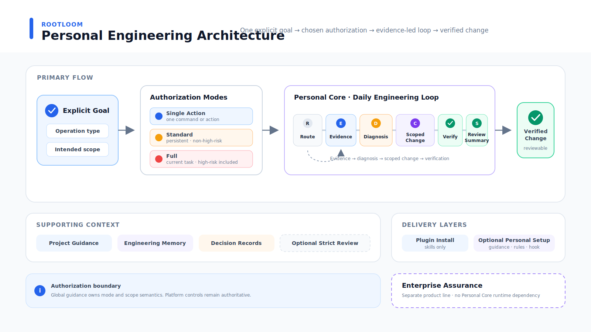

# Architecture

Rootloom `main` is Personal Core. Its architecture optimizes for a daily single-agent engineering loop rather than enterprise audit and approval.



## Product boundary

```text
Rootloom Personal Core
├── Core: Change / Review / Guidance
├── Optional Autonomy: authorization modes / Command Rules
├── Optional Evidence: Analyzer / Baseline / Contract / Seal / Finalizer
└── Experimental: Project Memory
```

The complete pre-split implementation is retained as the **Archived Assurance Edition** on `codex/enterprise-assurance`. It is recoverable source, not an actively maintained product line. `main` does not contain Human Review, Decision Pair, protected-deletion approval, custom-agent routing, strict audit Runner, hardened Artifact transactions, or recovery journals. See [the product-boundary decision](decisions/2026-07-16-personal-core-product-boundaries.md).

## Ownership paths

| Concern | Owner |
| --- | --- |
| Global task policy and semantic risk rules | `plugins/rootloom/assets/system/AGENTS.md` |
| Static risk and verification intelligence | `plugins/rootloom/skills/engineering-change/scripts/runner/intelligence.py` |
| Personal end-to-end change loop | `plugins/rootloom/skills/engineering-change/` |
| Tier 0/1 implementation discipline | `plugins/rootloom/skills/operating-coding-change/` |
| Tier 2 governed change | `plugins/rootloom/skills/operating-high-risk-change/` |
| Review-only workflow | `plugins/rootloom/skills/operating-code-review/` |
| Project/failure memory | `plugins/rootloom/skills/project-memory/` |
| Durable decision records | `plugins/rootloom/skills/record-engineering-decision/` |
| Deterministic project facts | `plugins/rootloom/skills/seed-project-guidance/` |
| Semantic guidance refinement | `plugins/rootloom/skills/refine-project-guidance/` |
| Codex-home setup | `plugins/rootloom/skills/setup-rootloom/` |
| Lifecycle Hook gate | `plugins/rootloom/hooks/run_component_hook.py` |

## Task intelligence

Risk classification uses effects rather than task size alone. `analyze_change.py` inspects task text, anticipated/current paths, Git operations, a bounded tracked patch, repository-owned commands, and relevant active project memory. It reports concrete signals, detected/effective risk, a minimum Tier, confidence, matching/stale memory, and a verification plan.

Path context prevents obvious over-classification: `docs/auth.md` or an auth test alone stays documentation/test scope, while product code such as `src/auth/token.py` raises the floor. Persisted state, money, authentication/authorization, concurrency, state machines, migrations, public contracts, infrastructure, destructive operations, or broad ownership span raise Tier. A declared risk can increase but never reduce the static floor.

The result is advisory. Semantic judgment remains in Skills and the model and may raise the Tier when consumers or effects are unknown. Deterministic Hooks never infer task risk, and the analyzer never authorizes an action.

## Engineering workflow

`engineering-change` is an opt-in instruction workflow, not an autonomous multi-agent state machine or an installation-time gate. The active Codex agent owns evidence, diagnosis, scope, implementation, verification, and final acceptance. Routine Tier 0/1 work uses repository evidence and proportional tests directly; installing Rootloom never starts the analyzer or finalizer.

For defects, `ROOT_CAUSE_ALIGNMENT: PASS` requires the observed trigger, owning boundary, violated invariant, evidence-backed cause, and rejection of the strongest plausible alternative. For features and mechanical work, alignment is `NOT_APPLICABLE` and the intended invariant is explicit.

Verification maps to behavior: the primary path, owning invariant, and an adjacent negative or alternate path. Risk-specific recommendations add auth boundaries, migration coexistence, financial idempotency, state ordering, deployment rollback, or consumer compatibility when relevant. Detected Make/test commands are suggestions only. Passing one convenient command is not automatically adequate, and a generated plan is never recorded as executed evidence.

## Lightweight artifact helper

`engineering-change/scripts/finalize_change.py` runs operator-supplied commands without a shell and writes:

```text
run/
├── diff.patch
├── test.log
└── summary.json
```

When strict Tier 1/2 evidence is explicitly requested, `begin_review.py` transactionally creates an outside-repository intake with a default `rootloom-change-baseline-v3`, editable `change-contract.draft.json`, and `rootloom-review-run-v2`. Baseline v3 names the local workflow fact `intake-sealed`; legacy baseline v2 with its historical wire value remains readable and sealable. An Intake-only `--reviewable-path FILE` may seal one exact file as reviewable, with an independent fixed maximum of 64 declarations. It resolves the declaration through bounded Git listing to the repository's actual spelling, then requires an existing single-link regular non-symlink target whose worktree changes remain visible to Git Status and Diff. It can pin an already-reviewable environment template or public certificate and can downgrade ambiguous material such as a public `.pem` or `.der`; ignored paths, `assume-unchanged` / `skip-worktree` entries, globs, case-fold ambiguity/duplicates, hardlinks, explicit sensitive overlap, and strong material fail closed. The same visibility, Index-state, spelling, type, and link checks run in each stable capture. The declaration remains a security-domain risk, is included in the policy hash, and switches that Intake to `rootloom-change-baseline-v4`.

Baseline readers validate historical v2/v3/v4 wire structure and hashes without reinterpreting old reviewable declarations through today's classifier. Finalizer separately applies the current 64-path and material policy; an incompatible historical declaration returns `reintake-required` before reviewable content is captured. Summary revision 5 keeps its wire revision; `reviewability_policy` exposes `policy_provenance` from the actually validated intake chain, `captured_files_provenance: final-capture-observed`, the compatibility `source` field with the same honest value, policy hash, paths, and final captured identity metadata. At least one scope path is required unless whole-repository scope is explicit; the default clean HEAD/index baseline can be relaxed only with `--allow-dirty-baseline`. Publication uses the platform's atomic no-replace directory primitive, so a concurrently created empty destination is never overwritten. The draft uses one exact Rootloom placeholder rather than substring-matching Todo-domain text. `seal_contract.py` validates the completed draft and exclusively creates the normalized final contract plus `rootloom-contract-seal-v1`. `--recover` validates and completes only an exact interrupted contract/seal publication; it never overwrites mismatched evidence. The seal binds canonical contract content, final contract bytes, and review-manifest bytes to the baseline hash, task hash, run ID, and nonce without requiring manifest edits.

Versioned baselines use canonical UUID/nonce/hash/timestamp fields and bind repository identity, HEAD, symbolic HEAD ref, and index. A repository capture is accepted only when two consecutive bounded snapshot/patch/Git-identity passes agree. Strict finalization rejects a moved base and repeats evidence-byte, seal, Git-base, and output-target validation after verification. Dirty baselines record pre-existing changes. A changed aggregate tracked patch conservatively scopes still-dirty tracked endpoints because v2/v3/v4 lack per-path tracked patch bytes; unchanged untracked entries remain exactly separable through their per-path fingerprints/metadata. One task partition is computed before risk analysis and then reused for contract scope and `diff.patch`, so exactly unchanged user-owned text cannot re-enter through another consumer. A pre-existing dirty path that disappears is a gate failure because it cannot be represented as a current task patch. Strict JSON decoding rejects duplicate keys and non-finite or out-of-range numbers.

Secret-material discovery uses shared case-insensitive Git pathspec candidates plus literal user-declared roots before applying `is_sensitive_material_path()`; it never enumerates every tracked and ignored path. Deliberately overmatching candidates have a separate bounded ceiling, while the configurable material-result ceiling is enforced only after classification; both fail closed. Material includes `.env`, `.envrc`, non-template `.env.<name>`, credential configuration, private-key/keystore formats, ambiguous `.pem` and `.der`, explicit roots, common key-named PEM/DER files, and CamelCase forms such as `clientSecret.json`, `apiToken.json`, and `serviceAccountKey.json`. Strong exact private-key names include `privkey.pem`, `privatekey.pem`, `rsa-key.pem`, `ec-key.pem`, `ecdsa-key.pem`, `ed25519-key.pem`, `encryption-key.pem`, and `decryption-key.pem`; reviewability declarations cannot downgrade them. Environment templates (`.env.example`, `.env.sample`, `.env.template`, `.env.dist`) and public certificate formats (`.crt`, `.cer`, `.p7b`, `.p7c`) are security-domain paths: they remain patch-readable but raise risk. DER is an encoding that can contain private keys, so it is metadata-only unless an eligible exact file is declared reviewable at Intake. `.environment`, `.envelope`, and `.envoy` are ordinary paths. Security-domain source such as `src/auth/token.py` follows the same risk-only boundary. Material regular files, directories, symlinks, tracked/ignored/untracked entries, and rename endpoints remain content-unread; symlink targets are hash-bound rather than persisted. Before ordinary content is read, capture compares the complete discovered material metadata set with the baseline or pre-verification reference, including ignored additions that Git status omits. Any reference drift or Git-observed material change quarantines every changed endpoint and disables project-memory/Makefile discovery. Ignored material additions, modifications, and deletions are synthesized into the same task-change set used by risk, scope, and summary logic. Metadata includes identity, link count, size, mode, modification time, and change time; this is reported as `metadata-observed`, not content integrity. See [the material/capture decision](decisions/2026-07-15-sensitive-material-and-capture-bounds.md).

`rootloom-change-contract-v1` uses segment-aware repository globs (`*`/`?` stay within one segment and `**` crosses segments), requires root-cause alignment, and maps behavior claims to explicitly executed commands. Only structured bindings from the sealed contract can complete strict claim coverage; CLI claims remain diagnostic. The summary keeps `format: rootloom-engineering-summary-v1` with `schema_revision: 5`, retains `risk_assessment`, and separates declared claims, qualifying claims, and `semantic_review`. `semantic_coverage: reviewed` is represented as `operator-asserted`, not machine proof. Unknown semantics can reach at most `MECHANICALLY_VERIFIED`; an unsealed assertion is `SEMANTIC_REVIEW_ASSERTED`; workflow-sealed mechanical evidence plus that assertion yields `REVIEW_EVIDENCE_COMPLETE`. That state means evidence-chain completion, not proven correctness. `evidence_complete` is the stable automation capability, while `quality_status` remains the detailed diagnostic enum. Summary provenance uses `intake-sealed` and `workflow-sealed`, which describe local workflow facts rather than identity. Sensitive redaction caps an otherwise-complete review at `REVIEW_REQUIRED_WITH_REDACTIONS`, `evidence_complete: false`, and `passed: false`. Strict mode defaults to quality exit codes, while `--strict-bundle-only` is the explicit non-blocking form. Advisory mode remains bundle-oriented and opt-in. See [the evidence-honest Strict Review decision](decisions/2026-07-15-evidence-honest-strict-review.md).

All command strings are parsed before any verification command executes. Verification then runs in a controlled local process group or Windows Job Object and records `process_convergence` plus `isolation: process-group-only`; Windows falls back to parent/pipe observation and system process-tree termination when Job Object assignment is unavailable. After the parent exits, a bounded grace lets asynchronous Windows Job Object accounting converge before Rootloom classifies remaining processes as leaked descendants. This is not a sandbox for untrusted commands and cannot guarantee control of detached services, containers, privileged background managers, ignored non-sensitive files, Git administrative state, or external state. Command argv and output are retained verbatim in the local bundle.

Status and Git diff are streamed through byte/path ceilings before retention. Every Git command also uses the verification process-tree controller with a finite-positive per-command time budget, output ceiling, and descendant cleanup. In addition, one finite-positive `--max-capture-seconds` monotonic deadline (90 seconds by default) is shared across both passes of each stable capture; every Git child receives the smaller of the remaining aggregate time and `--max-git-seconds`, and bounded Python loops checkpoint the same deadline. The limit applies separately to the pre- and post-verification stable-capture lifecycles; `capture_duration_seconds` is their combined observed time. Verification output is consumed incrementally and timeout, output overflow, or leaked descendants terminates the controlled POSIX process group or Windows Job Object. Lexical path and parent-chain checks reject symlinked evidence/output locations before resolved containment checks. Evidence and output must be outside both the repository worktree and resolved Git common directory; output must additionally be absent, empty, or Rootloom-owned. This keeps linked-worktree evidence out of refs, objects, and other Git administration. A reused owned output invalidates its previous summary before the new run can exit early. The complete patch has a configurable 16 MiB default refusal ceiling. Secret-material deletions require exact confirmation; security-source deletions raise risk without invoking the privacy confirmation. This remains a mutable review bundle, not an immutable audit record.

Runner helpers are deliberately small:

- `process.py` — bounded subprocess execution;
- `state.py` — bounded Git state, untracked fingerprints, and patches;
- `baseline.py` — pre-change sensitive/state producer-consumer contract;
- `change_contract.py` — path scope and verification-claim enforcement;
- `review_run.py` — exact review-manifest and contract-seal schemas;
- `evidence_paths.py` — lexical no-symlink evidence path checks;
- `strict_json.py` — duplicate-free, finite evidence JSON decoding;
- `verification.py` — command parsing and ordered checks;
- `intelligence.py` — advisory risk, memory matching, and verification planning;
- `contracts.py` — summary/result formats;
- `errors.py` — stable local failures.

## Experimental Project Memory

An explicit `seed-project-guidance` call writes reproducible facts to managed `AGENTS.md` blocks; the SessionStart Hook never does. Experimental `.project-memory/` stores optional reviewable architecture, risks, decision indexes, and failure lessons. `project_memory.py context` selects relevant entries lexically by task/path, bounds output, and separates expired/resolved/superseded matches from active context. New records have deterministic identity, evidence references, lifecycle state, and optional expiry; exact duplicates are suppressed. Memory is explicitly created/updated and never outranks current executable evidence.

The persisted envelope remains `rootloom-project-memory-v1`. Legacy entries without identity or lifecycle metadata remain readable and context never rewrites them. The CLI and analyzer share one strict no-follow descriptor reader, schema, entry limit, legacy identity, relevance, status, and expiry contract; malformed or over-limit files are never silently truncated by one consumer. Explicit writers reload, deduplicate, and atomically replace while holding `.project-memory/memory.lock`.

Accepted durable architecture and contract decisions still belong in repository decision records. The memory decision file is only a compact index.

## Setup and Hook boundary

Plugin installation is complete after Codex adds the plugin: Skills become available, while global guidance, command Rules, Hook policy, and setup state remain absent. Optional Personal setup manages those copied global assets only after an explicit user request. Its `install` handles first setup; `upgrade` preserves the installed capability selection, records version-only changes without redundant asset backups, backs up changed assets, and safely retires pristine targets that disappear from the catalog. Both status and upgrade validate installed paths, compare targets with installed hashes, and refuse post-install drift. Compatibility `apply` remains available. Setup is plan-first, conflict-refusing, serialized by a create-exclusive local lock, and atomic per target.

The copied global guidance owns semantic authorization: Standard permission persists across tasks for the non-high-risk steps of each explicit goal, while Single action and Full are one-action/current-task elevations. Static command Rules cannot carry that context, so optional `autonomy` always includes `global-policy`; the Rules reduce duplicate prompts and retain only a catastrophic recursive-deletion hard deny. This is a low-confirmation authorization mode, not deterministic command safety. See [the tiered authorization decision](decisions/2026-07-14-tiered-authorization-modes.md).

This design does not provide cross-file crash atomicity, hostile same-user protection, or recovery-journal replay. A partial interrupted apply is visible through `status`; backup contents remain inspectable.

The only lifecycle Hook is read-only `SessionStart` project-context detection. It requires managed component policy with exact integer `version: 1`; missing, malformed, wrong-type, future-version, or symlinked policy disables it. The scanner stays deterministic, bounded, standard-library-only, network-free, and repository-contained. Persisting guidance is a separate explicit Skill action.

## Dependency and portability boundary

Runtime helpers use Python 3.11+ standard library only. Normal tests cover Linux, macOS, and Windows-compatible contracts. The optional live smoke needs an installed, logged-in Codex CLI and runs only against a disposable `CODEX_HOME`.
