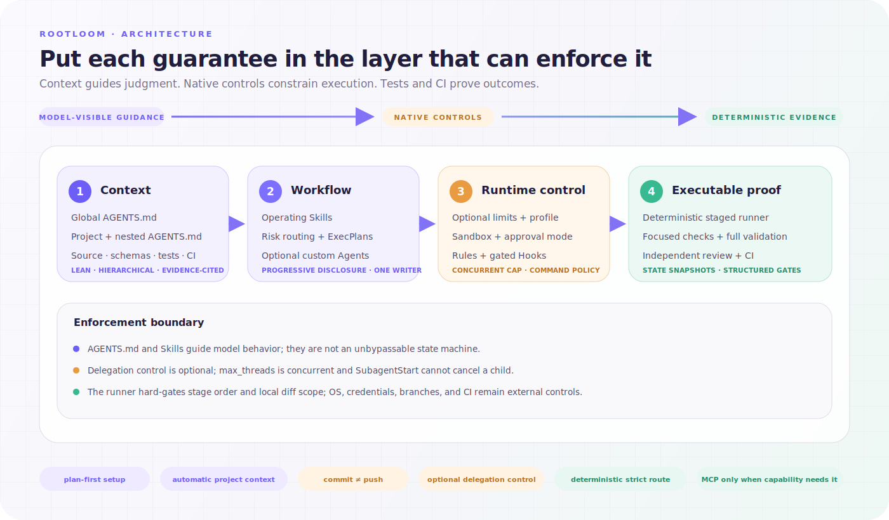

# 架构

Rootloom `main` 是 Personal Core。架构目标是个人每天使用的单代理工程闭环，而不是企业审计与审批。



## 产品边界

```text
Rootloom Personal Core
├── Task Intelligence
│   ├── 静态任务 / 路径 / diff 信号
│   ├── 相关记忆信号
│   ├── 可解释最低 Tier
│   └── 工作流选择
├── Engineering Workflow
│   ├── Evidence
│   ├── Diagnosis
│   ├── Change Contract
│   ├── Implementation
│   ├── Verification Intelligence
│   └── Final Review Summary
├── Memory
│   ├── 架构不变量
│   ├── 已知风险与失败经验
│   ├── 持久决策索引
│   └── 相关性 / 生命周期过滤
└── Local Runtime
    ├── 可选 SessionStart 播种
    ├── Command Rules
    ├── 简单 setup 备份/回滚
    └── 轻量验证产物
```

拆分前的完整 Assurance 实现在 `codex/enterprise-assurance` 保留。`main` 不包含 Human Review、Decision Pair、protected-deletion approval、自定义代理路由、严格审计 Runner、加固 Artifact 事务或恢复日志。

## 所属路径

| 关注点 | 所属实现 |
| --- | --- |
| 全局任务策略与语义风险规则 | `plugins/rootloom/assets/system/AGENTS.md` |
| 静态风险与验证智能 | `plugins/rootloom/skills/engineering-change/scripts/runner/intelligence.py` |
| 个人端到端修改闭环 | `plugins/rootloom/skills/engineering-change/` |
| Tier 0/1 实施纪律 | `plugins/rootloom/skills/operating-coding-change/` |
| Tier 2 治理式修改 | `plugins/rootloom/skills/operating-high-risk-change/` |
| 仅审查工作流 | `plugins/rootloom/skills/operating-code-review/` |
| 项目/失败记忆 | `plugins/rootloom/skills/project-memory/` |
| 持久决策记录 | `plugins/rootloom/skills/record-engineering-decision/` |
| 确定性项目事实 | `plugins/rootloom/skills/seed-project-guidance/` |
| 语义指导精炼 | `plugins/rootloom/skills/refine-project-guidance/` |
| Codex-home setup | `plugins/rootloom/skills/setup-rootloom/` |
| 生命周期 Hook 门禁 | `plugins/rootloom/hooks/run_component_hook.py` |

## Task Intelligence

风险判断依据影响，而不只是任务大小。`analyze_change.py` 检查任务文本、预期/当前路径、Git 操作、有界 tracked patch、仓库命令和相关活跃项目记忆，输出具体信号、检测/有效风险、最低 Tier、置信度、匹配/过期记忆与验证计划。

路径上下文避免明显误判：单独的 `docs/auth.md` 或 auth 测试仍属于文档/测试范围，`src/auth/token.py` 等产品代码则会提高下限。持久状态、资金、认证/授权、并发、状态机、迁移、公共契约、基础设施、破坏性操作或跨越多个所属边界都会提高 Tier。人工风险声明只能提高、不能降低静态下限。

结果只是建议。语义判断继续由 Skills 和模型负责；消费者或影响未知时可以继续提高 Tier。确定性 Hook 不推断任务风险，扫描器也不授权任何操作。

## Engineering Workflow

`engineering-change` 是显式按需的指导工作流，不是自主多代理状态机或安装时门禁。当前 Codex 代理负责证据、诊断、范围、实现、验证和最终接受。普通 Tier 0/1 工作直接使用仓库证据与成比例测试；安装 Rootloom 永远不会启动 analyzer 或 finalizer。

缺陷的 `ROOT_CAUSE_ALIGNMENT: PASS` 必须包含触发方式、所属边界、被违反的不变量、有证据的根因以及对最强替代假设的否定。功能或机械任务使用 `NOT_APPLICABLE` 并明确目标不变量。

验证对应行为：主路径、所属边界不变量、相邻负向或替代路径。识别到对应风险时，还会要求 auth 边界、迁移共存、资金幂等、状态顺序、部署回滚或消费者兼容等检查。发现的 Make/test 命令只是建议；一个方便命令通过不等于验证完整，生成的计划也不会冒充已执行证据。

## 轻量产物辅助工具

`engineering-change/scripts/finalize_change.py` 不使用 shell 执行操作方给定命令，并写入：

```text
run/
├── diff.patch
├── test.log
└── summary.json
```

只有明确要求严格 Tier 1/2 证据时，`begin_review.py` 会在实现前以独占方式创建仓库外 intake 目录，写入 `rootloom-change-baseline-v2` 与 contract skeleton。Analyzer 生成的 v2 baseline 包含 `run_id`、`nonce`、`task_sha256`、producer version、repository identity、Git identity 与 sensitive-policy hash；v1 baseline 仍可作为 self-declared 兼容输入读取。Baseline 绑定有界 Git/untracked 状态以及只含元数据的 ignored/secret-like 状态，使 Finalizer 能发现 Git status 看不到的 intake 敏感删除。普通 untracked 文件使用流式 Hash 与有界文本 patch；二进制/大文件记录类型、大小与 Hash；敏感文件、目录和 symlink 永不读取内容。

`rootloom-change-contract-v1` 用 allowed/forbidden glob 约束实际路径，要求缺陷工作声明根因对齐，并把主路径/不变量/相邻路径及风险专属 claim 映射到显式执行命令。Operator-sealed contract 还会引用 baseline 的 hash、`run_id`、`nonce` 与 `task_sha256`；结构化 claim binding 必须声明 command IDs、target、evidence kind 与 expected evidence。仅写在契约里的命令不构成执行授权。Summary 保持 `format: rootloom-engineering-summary-v1`，并增加 `schema_revision: 2`；它保留 `risk_assessment`，同时分开表达命令退出成功、捕获保留、`claim_binding`、兼容字段 `verification_coverage`、`semantic_coverage`、provenance、hash chain 与 `quality_status`；兼容字段 `passed` 只会在 operator-sealed 的 `VERIFIED_CHANGE` 时为 true。Advisory 模式可省略 baseline/contract，默认 `--exit-policy bundle` 会在命令通过且捕获稳定时退出 0，同时报告 `UNVERIFIED`；自动化可使用 `--exit-policy quality` 或 `--require-verified`。

验证运行在受控本地 process group 或 Windows Job Object 中，并记录 `process_convergence` 与 `isolation: process-group-only`。这不是执行不可信命令的沙箱，无法保证控制 detached service、容器或特权后台管理器。

Status 与 Git diff 在保留前即通过字节/路径上限流式捕获。验证输出增量读取；超时、输出超限或残留子进程会终止受控 POSIX process group 或 Windows Job Object。输出目录必须位于仓库外，且不存在、为空或由 Rootloom 标记拥有。完整 patch 默认上限为可配置的 16 MiB。敏感删除要求精确确认。这仍是可变审查包，不是不可篡改审计记录。

Runner 辅助模块保持小型：

- `process.py`：有界子进程；
- `state.py`：有界 Git 状态、untracked 指纹与 patch；
- `baseline.py`：修改前敏感/状态生产者—消费者契约；
- `change_contract.py`：路径范围与验证 claim 门禁；
- `verification.py`：命令解析与顺序检查；
- `intelligence.py`：建议式风险、记忆匹配与验证规划；
- `contracts.py`：摘要/结果格式；
- `errors.py`：稳定本地失败。

## Memory

项目指导扫描器把可复现事实写入托管 `AGENTS.md` 区块。`.project-memory/` 保存可选、可审查的架构、风险、决策索引和失败经验。`project_memory.py context` 根据任务/路径做词法相关性选择，限制输出，并把过期/已解决/已替代条目与活跃上下文分开。新记录带确定性 ID、证据引用、生命周期状态与可选过期时间；完全重复会被抑制。记忆只会显式创建/更新，并且永远不能高于当前可执行证据。

持久 envelope 继续使用 `rootloom-project-memory-v1`。没有 ID 或生命周期元数据的旧条目继续可读，`context` 永远不会重写它们。CLI 与 Analyzer 共用同一套严格 no-follow descriptor reader、Schema、条目上限、Legacy ID、相关性、状态与过期契约；某个消费者不会再静默截断另一个消费者判为非法的文件。显式写入会在持有 `.project-memory/memory.lock` 时重新读取、去重并原子替换。

接受后的持久架构与契约决策仍应写入仓库决策记录；memory 中的 decision 文件只是简短索引。

## Setup 与 Hook 边界

Codex 添加插件后安装即完成：Skills 可用，但全局指导、命令 Rules、Hook 策略与 setup 状态仍不存在。只有用户明确要求时，可选 Personal setup 才管理这些复制的全局资产。其 `install` 负责首次 setup；`upgrade` 保持已安装 capability，只有版本变化时不创建多余资产备份，资产变化时先备份，并安全退役已从新版目录移除且未漂移的目标。`status` 与 `upgrade` 都会校验已安装路径、对照已安装 Hash 并拒绝安装后漂移。兼容命令 `apply` 继续保留。setup 先计划、拒绝冲突、使用 create-exclusive 普通锁串行、逐目标原子写入。

该设计不提供跨文件崩溃原子性、敌对同用户保护或恢复日志重放。中断造成的部分 apply 会通过 `status` 暴露，备份内容仍可检查。

唯一生命周期 Hook 是 `SessionStart` 项目指导播种。组件策略缺失、损坏或为符号链接时会关闭执行。扫描器继续保持确定性、有界、仅标准库、无网络、仓库内执行与快照保留。

## 依赖与可移植性

运行时辅助工具只使用 Python 3.11+ 标准库。普通测试覆盖 Linux、macOS 与 Windows 兼容契约。可选 live smoke 需要已经安装并登录的 Codex CLI，只使用可丢弃 `CODEX_HOME`。
